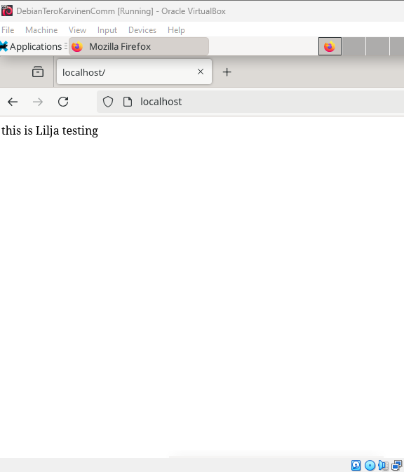
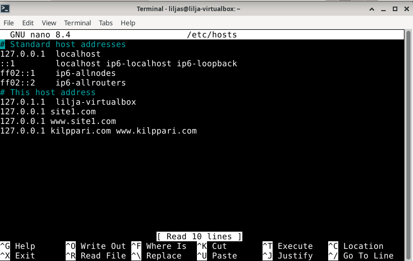
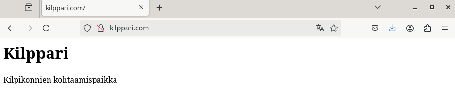

# h3-Hello-Web-Server
 
## Sisältö
* [x) Artikkeli](#x-artikkeli)
* [a) Apache-weppipalvelimen testaus](#a-apache-weppipalvelimen-testaus)
* [b) Lokien analysointi](#b-lokien-analysointi)
* [c) Etusivun uusiminen - uusi name based virtual host](#c-etusivun-uusiminen---uusi-name-based-virtual-host)

### x) Artikkeli

## Koneen tekniset tiedot
* Prosessori: Intel Core i5-8265U CPU @ 1.60 GHz (1.80 GHz turbo, 8 ydintä)
* RAM: 16 GB (15,7 GB käytettävissä)
* Järjestelmä: Windows 11 Pro 64-bittinen (x64-suoritin)
* Näytönohjain: Intel UHD Graphics 620
* Tallennustila: 237 GB, josta 158 GB vapaana
* DirectX-versio: DirectX 12

### a) Apache-weppipalvelimen testaus

Apache-webpalvelin oli keretty asentaa oppitunnilla. Siirryin 5.9.2025 kello 19.52 tehtävän ensimmäiseen vaiheeseen eli testaamaan että webpalvein vastaa localhost-osoitteesta.

* Avasin virtuaalikoneen ja seuraavaksi internet-selaimen
* syötin osoitekenttään: http://localhost
  - Apache-webpavelin vastasi localhost osoitteesta ja käyttää oletuksena porttia 80.

_Onnistunut testaus_ 

### b) Lokien analysointi
Lokien analysoinnissa hyödynsin Heinosen (2025), Sumo logicin, sekä stack overflown ohjeita. Etenin seuraavasti:

Suoritin alla olevan komennon Terminalissa:
* `sudo tail -f /var/log/apache2/access.log` komentorivi Terminaliin
  

# Lokiriveissä havaitsin seuraavat asiat

* **127.0.0.1** - IP-osoite (Client IP)
  
* **[05/Sep/2025:20:52:18 +0300]** - Päivämäärä ja kllonaika, jolloin pyyntö vastaanotettu
  
*  **GET /favicon.ico HTTP/1.1** - Pyynnön tyyppi(GET), kohde (/favicon.ico) ja HTTP versio (1.1.)
  
*  **404** - HTTP-statuskoodi - palvelin ei löytänyt pyydettyä resurssia (mutta en hätääntynyt, sllä sivu latautui normaalisti auki)
  
*  **488** - Objektin koko joka palautui asiakkaalle / Object size returned to client
  
*  **Mozilla/5.0 (X11; Linux x86_64; rv:128.0) Gecko/20100101 Firefox/128.0** - loppukäyttäjän(end user) käyttämä selaintieto

### c) Etusivun uusiminen - uusi name based virtual host 
Lähdin tässä tehtävässä luomaan uuden name-based virtual hostin. Ideana on että sivu näkyy suoraan plvelimen etusivulla http://localhost/.

Käytin tässä tehävässä apuna Karvisen (2018) ohjetta.

* `sudoedit /etc/apache2/sites-available/starwars.conf´
  
* `cat /etc/apache2/sites-available/starwars.com.conf`
<VirtualHost *:80>
 ServerName kilppari.com
 ServerAlias www.kilppari.com
 DocumentRoot /home/liljas/publicsites/kilppari.com
 <Directory /home/liljas/publicsites/kilppari.com>
   Require all granted
 </Directory>
</VirtualHost>

* `sudo a2ensite kilppari.com`
 
* `sudo systemctl restart apache2`

Alla oleva virhetilanne tuli sinä kohtaa kun syötin komennon ´curl -H 'Host: kilppari.com' localhost`

_Virhetilanne_

Lähdin selvittämään ja korjaamaan tilanteen alla olevilla toimenpiteillä:

* `chmod ugo+x /home/liljas/publicsites/kilppari.com` -komennolla käyttäjien oli mahdollista päästä hakemistoon - joka näin ollen korjasi "Forbidden" tilanteen
 

_chmod komento_

* sudo nano ´/etc/hosts/´ komennolla avasin tiedoston sillä selain näytti tyhjää vaikka ´curl -H 'Host: kilppari.com' localhost`-toimi. Lisäsin host-nimen loppuosaan ja tallensin vielä Ctrl + O ja Enter. On tärkeää huomioida, että tiedoston muokkaaminen vaatii root-oikeudet

Tässä kohtaa kello olikin jo tovin (21:30), sillä jäin selvittelemään mistä vika voisi johtua.

_pyydetään koneen palvelimelta sivuston sisältö_

**Lopputulos**
Karvisen (2025) ohjeissa luki selkeästi "Vinkit" -osiossa kotisivu kielletty -(403 Forbidden) virhetilanteen korjaava komento. Toki tämä jäi huomaamatta - mutta sentään se tuli havaittua lopulta. 

_Onnistuminen_

## Lähteet
Linuxize. 2023. Artikkeli. _Chown Command in Linux (File Ownership)_ Luettavissa: https://linuxize.com/post/linux-chown-command/ Luettu 05.09.2025

Girvin, D. 2025. Artikkeli. _Understanding the Apache access log: how to view, locate, and analyze_ Luettavissa:  https://www.sumologic.com/blog/apache-access-log Luettu 05.09.2025.

The Apache Software Foundation. 2023. Artikkeli. _Name-based Virtual Host Support_ Luettavissa: https://httpd.apache.org/docs/2.4/vhosts/name-based.html Luettu: 

Heinonen, J. 2025. Artikkeli. _Apache2_ Luettavissa: https://github.com/johannaheinonen/johanna-test-repo/blob/main/linux-03092025.md Luettu: 03.09.2025.

Karvinen, T. 2018. Artikkeli. _Name Based Virtual Hosts on Apache – Multiple Websites to Single IP Address_ Luettavissa: https://terokarvinen.com/2018/04/10/name-based-virtual-hosts-on-apache-multiple-websites-to-single-ip-address/ Luettu: 05.09.2025.

Karvinen, T. 2025. Verkkosivu. _Linux-palvelimet_ Luettavissa: https://terokarvinen.com/linux-palvelimet/ Luettu 05.09.2025.

Stack overflow. 2022. _Understanding Apache's access log_ Luettavissa: https://stackoverflow.com/questions/9234699/understanding-apaches-access-log Luettu: 05.09.2025

