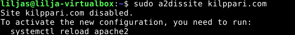
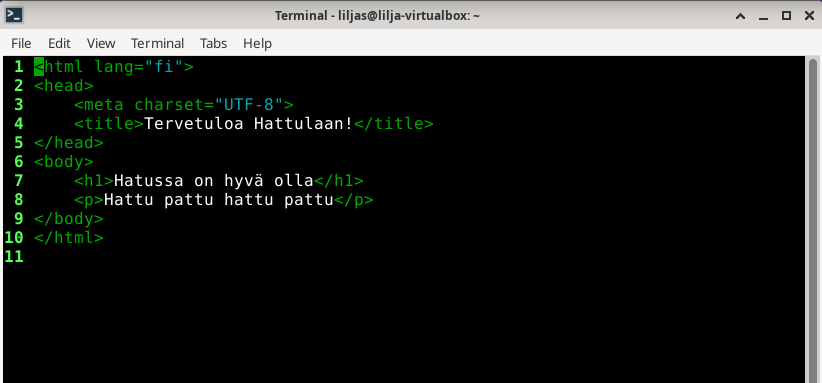
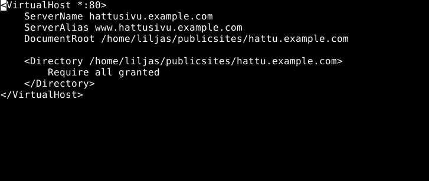
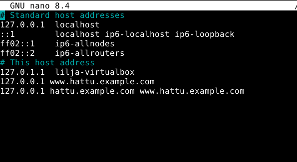
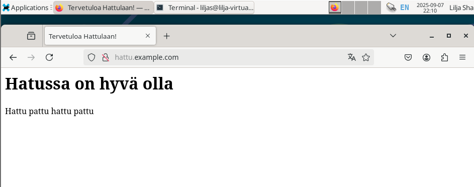
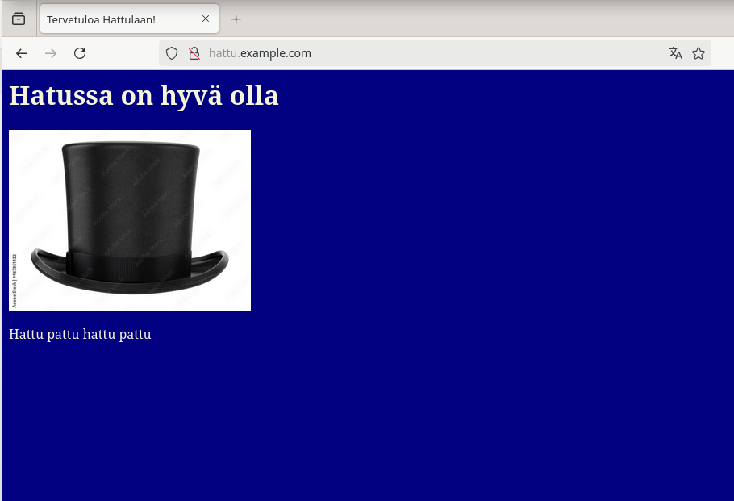

# h3-Hello-Web-Server
 
## Sisältö
* [x) Artikkeli](#x-artikkeli)
* [a) Apache-weppipalvelimen testaus](#a-apache-weppipalvelimen-testaus)
* [b) Lokien analysointi](#b-lokien-analysointi)
* [c) Etusivun uusiminen - uusi name based virtual host](#c-etusivun-uusiminen---uusi-name-based-virtual-host)

### Koneen tekniset tiedot
* Prosessori: Intel Core i5-8265U CPU @ 1.60 GHz (1.80 GHz turbo, 8 ydintä)
* RAM: 16 GB (15,7 GB käytettävissä)
* Järjestelmä: Windows 11 Pro 64-bittinen (x64-suoritin)
* Näytönohjain: Intel UHD Graphics 620
* Tallennustila: 237 GB, josta 158 GB vapaana
* DirectX-versio: DirectX 12

# x) Artikkeli

# a) Apache-weppipalvelimen testaus

Apache-webpalvelin oli keretty asentaa oppitunnilla. Siirryin 5.9.2025 kello 19.52 tehtävän ensimmäiseen vaiheeseen eli testaamaan että webpalvein vastaa localhost-osoitteesta.

* Avasin virtuaalikoneen ja seuraavaksi internet-selaimen
* syötin osoitekenttään: http://localhost
  - Apache-webpavelin vastasi localhost osoitteesta ja käyttää oletuksena porttia 80.

_Onnistunut testaus_ 

# b) Lokien analysointi
Lokien analysoinnissa hyödynsin Heinosen (2025), Sumo logicin, sekä stack overflown ohjeita. Etenin seuraavasti:

Suoritin alla olevan komennon Terminalissa:
* `sudo tail -f /var/log/apache2/access.log` komentorivi Terminaliin
  

 **Lokiriveissä havaitsin seuraavat asiat**

* **127.0.0.1** - IP-osoite (Client IP)
  
* **[05/Sep/2025:20:52:18 +0300]** - Päivämäärä ja kllonaika, jolloin pyyntö vastaanotettu
  
*  **GET /favicon.ico HTTP/1.1** - Pyynnön tyyppi(GET), kohde (/favicon.ico) ja HTTP versio (1.1.)
  
*  **404** - HTTP-statuskoodi - palvelin ei löytänyt pyydettyä resurssia (mutta en hätääntynyt, sllä sivu latautui normaalisti auki)
  
*  **488** - Objektin koko joka palautui asiakkaalle / Object size returned to client
  
*  **Mozilla/5.0 (X11; Linux x86_64; rv:128.0) Gecko/20100101 Firefox/128.0** - loppukäyttäjän(end user) käyttämä selaintieto

# c) Etusivun uusiminen - uusi name based virtual host 

Käytin tässä tehävässä apuna Karvisen (2018), Heinosen (2025) ja Fritsch (2009) ohjeita.

1. Poistin vanhan virtual hostin `kilppari.com` jonka kävin testimielessä tunnin jälkeen tekemässä komennoilla:

- `sudo a2dissite kilppari.example.com`
  
- `systemctl reload apache2`

2. Loin uuden kansion kotihakemistoon ja kirjoitin web-sivun sisällön index.html tiedostoon micro-editorilla.

- `mkdir -p hattu.example.com`
 
- `micro hattu.example.com/index.html`

3. Aloitin kirjoittamaan web-sivun sisältöä.

Oli tärkeää havaita mitä asiaa tein - sillä voi helposti mennä sekaisin luullen, että kirjoittaa Apache-konfiguraatiota tässä kohtaa.

* `micro hattu.example.com/index.html` -komennolla kirjoitetaan siis **web-sivun sisältö**, eli:

**< meta charset="UTF-8" >** -Suomenkieliset merkit näkyviin

**< html >** - Juurielimentti, www-sivun aloittava tagi. Kertoo selaimelle että tiedosto on HTML.

**< head >** - Pääosa, headeri. Määritellään otsikko web-palvelimelle/sivulle

**< title >** - Otsikko selaimen ikkunassa 

**< body >** - Sivurungon aloittava tagi

**< p >** - Kappaleen vaihto

- Lopuksi vielä ctrl + S ja ctrl + Q
  
4. Lähdin Apachen konfiguraation pariin syöttämällä komennot 
   
- `cd /etc/apache2/sites-available/`
  
- `sudoedit /etc/apache2/sites-available/hattu.example.conf`

5. Otin käyttöön web-sivuston ja käynnistin Apachen uudelleen seuraavasti edeten:

* `sudo a2ensite hattu.example.com`
 
* `sudo systemctl restart apache2`

6. Lopuksi vielä testasin avaamalla verkkoselaimen ja käytin curl -komentoa:
   
- `hattu.example.com`

- `curl hattu.example.com`

**Virhetilanne** 

- Kuten kuvassa ilmenee, `curl http://hattu.example.com` komennolla tuli virheilmoitus **"curl: (6) Could not resolve host: curl http://hattu.example.com.** Apache oli kuitenkin konfiguroitu ja oli aktiivinen

- Kävin läpi Heinosen (2025) ohjeet uudelleen, jossa ilmenikin yksi kohta, jonka olin tunnilla unohtanut olevan tarpeen tehdä. 
 
- `/etc/hosts`-tiedostoon piti käydä lisäämässä rivi (eli kohdistamaan hostname IP-osoitteeseen) alla olevan kuvan mukaisesti.

**Lopputulos**

_Onnistunut uusi etusivu_

# e) Validin HTML5 -sivun luominen

Jatkoin raportin tekoa 7.9.2025 kello 17:30 aikaan. 

Pääsin suht helpolla tässä tehtävänosassa, sillä löysin hyvän oppimateriaalin Jyväskylän yliopiston verkkosivuilta (2012) josta katsoin ohjeet oikeaoppisen HTML5-sivun sisällön tekoon.

Validin HTML5 -sivun tarkistaminen tapahtui tehtävänannon mukaisesti osoitteesta: https://validator.w3.org/nu/#file

Tässä oli tärkeää ymmärtää hakea **virtuaalikoneen internet-selaimesta** kyseinen sivu, en ollut käyttänyt kyseistä sivua aikaisemmin, joten tässä meni hetki hahmottaessa. 

Tarkistaminen tapahtui:
* Validate by File Upload - välilehdestä klikkaamalla
* Klikkasin sieltä "Browse"
* Uusi File Upload -ikkuna aukesi jossa etenin etsimään oikean tiedoston klikkaamalla **home > publicsites > hattu.example.com > index.html**

Ilokseni virheitä ei ollut alla olevan kuvan mukaisesti

_Ei virheitä_

Lopuksi kuitenkin hieman aikaa vievää vääntöä loppuun, kun halusin vielä kokeilla lisätä kuvan ja väriä sivulle.

_Hieno hattu kuva lisätty_

# f) Anna esimerkit 'curl -I' ja 'curl' -komennoista. Selitä 'curl -I' muutamasta näyttämästä otsakkeesta (response header), mitä ne tarkoittavat.

# m) Vapaaehtoinen, suosittelen tekemään: Hanki GitHub Education -paketti.

# o) Vapaaehtoinen, vaikea: Laita sama tietokone vastaamaan kahdellla eri sivulla kahdesta eri nimestä. Eli kaksi weppisiteä samalla koneelle, esim. foo.example.com ja bar.example.com. Voit simuloida nimipalvelun toimintaa hosts-tiedoston avulla.

## Lähteet

Fritsch S. 2009. Verkkosivu. _Ubuntu manuals_ Luettavissa: https://manpages.ubuntu.com/manpages/questing/en/man8/a2ensite.8.html Luettu: 05.09.2025.

Linuxize. 2023. Artikkeli. _Chown Command in Linux (File Ownership)_ Luettavissa: https://linuxize.com/post/linux-chown-command/ Luettu 05.09.2025

Girvin, D. 2025. Artikkeli. _Understanding the Apache access log: how to view, locate, and analyze_ Luettavissa:  https://www.sumologic.com/blog/apache-access-log Luettu 05.09.2025.

The Apache Software Foundation. 2023. Artikkeli. _Name-based Virtual Host Support_ Luettavissa: https://httpd.apache.org/docs/2.4/vhosts/name-based.html Luettu: 

Heinonen, J. 2025. Artikkeli. _Apache2_ Luettavissa: https://github.com/johannaheinonen/johanna-test-repo/blob/main/linux-03092025.md Luettu: 03.09.2025.

Karvinen, T. 2018. Artikkeli. _Name Based Virtual Hosts on Apache – Multiple Websites to Single IP Address_ Luettavissa: https://terokarvinen.com/2018/04/10/name-based-virtual-hosts-on-apache-multiple-websites-to-single-ip-address/ Luettu: 05.09.2025.

Karvinen, T. 2025. Verkkosivu. _Linux-palvelimet_ Luettavissa: https://terokarvinen.com/linux-palvelimet/ Luettu 05.09.2025.

Stack overflow. 2022. _Understanding Apache's access log_ Luettavissa: https://stackoverflow.com/questions/9234699/understanding-apaches-access-log Luettu: 05.09.2025

Vahtera, P. 2018. Verkkosivu. _HTML5 ja Web-sivun rakenne_ Luettavissa: https://punomo.fi/html5-ja-web-sivun-rakenne/
Luettu: 06.09.2025.

http://sumologic.com/blog/apache-access-log Luettu: 06.09.2025.

https://kirjat.it.jyu.fi/linkki/nettisivut_ohjelmointi/html.html Luettu: 06.09.2025.

Sashkin. 2025. _Cylinder black top hat – silinterihattu_ Adobe Stock. Saatavissa: https://adobe.ly/3Zp9q3i Viitattu 7.9.2025
